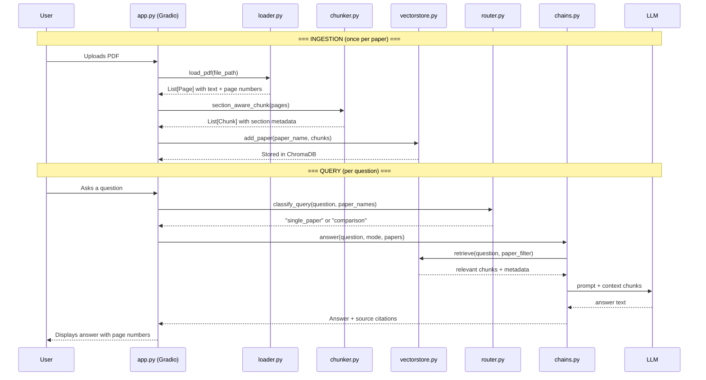
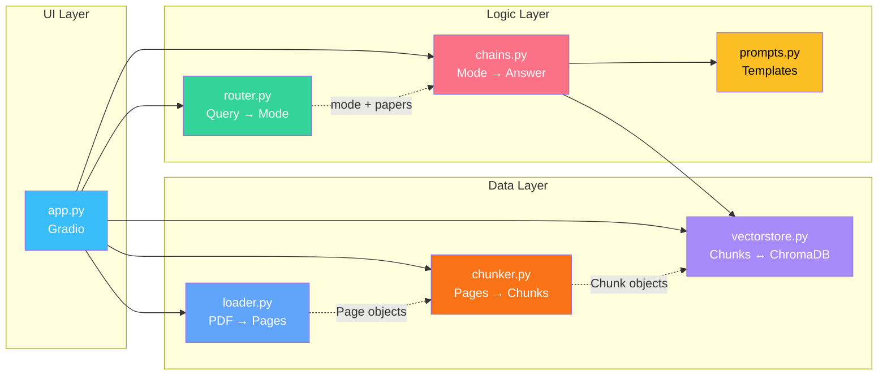

# Research Paper Q&A Agent 

A **Retrieval-Augmented Generation (RAG)** system that lets you upload academic PDFs and ask questions in natural language — receiving cited answers with page numbers.

Built as a portfolio project to demonstrate end-to-end RAG pipeline design, from PDF ingestion to a working local demo. An evaluation scaffold is included; benchmark results are still future work.

## Table of Contents

- [What It Does](#what-it-does)
- [Architecture](#architecture)
  - [Data Flow](#data-flow)
  - [Module Architecture](#module-architecture)
- [Core Technical Contribution: Section-Aware Chunking](#core-technical-contribution-section-aware-chunking)
  - [The Problem](#the-problem)
  - [The Solution](#the-solution)
  - [Measurable Impact](#measurable-impact)
- [Tech Stack](#tech-stack)
- [Setup](#setup)
  - [Prerequisites](#prerequisites)
  - [Installation](#installation)
  - [Local model with Ollama](#local-model-with-ollama)
  - [Hosted model](#hosted-model)
- [Evaluation](#evaluation)
  - [Run the evaluation](#run-the-evaluation)
  - [Evaluation Metrics](#evaluation-metrics)
- [Running Tests](#running-tests)
- [Project Structure](#project-structure)
- [Design Decisions & Trade-offs](#design-decisions--trade-offs)
  - [Why keyword routing instead of LLM routing?](#why-keyword-routing-instead-of-llm-routing)
  - [Why local-first (Ollama + ChromaDB)?](#why-local-first-ollama--chromadb)
  - [Why both chunking strategies?](#why-both-chunking-strategies)
- [Future Work](#future-work)
- [License](#license)

## What It Does

1. **Upload** any academic PDF (lecture notes, papers, reports)
2. **Ask questions** in natural language — single-paper or cross-paper comparisons
3. **Get cited answers** with `[p. X]` references to the exact source pages
4. **Compare papers** side-by-side with auto-generated markdown tables

> _"What is the McGurk Effect?"_ → Answer citing `[p. 3]` from the perception paper
>
> _"Compare digital vs analog electronics"_ → Structured comparison table with citations from both papers

---

## Architecture

### Data Flow



### Module Architecture



Dependencies flow **downward** (UI → Logic → Data) or **sideways** (chains → prompts). No circular imports. Each module is independently testable.

---

## Core Technical Contribution: Section-Aware Chunking

The key differentiator of this project is **section-aware text splitting** for academic documents.

### The Problem

Standard RAG tutorials use `RecursiveCharacterTextSplitter`, which splits text at arbitrary character boundaries. For academic papers, this creates chunks that:
- Mix content from different sections (e.g., half "Methods" + half "Results")
- Split equations, tables, and figures mid-way
- Lose structural context that helps the LLM reason about the content

### The Solution

`section_aware_chunk()` in [`chunker.py`](src/chunker.py) detects section boundaries using regex patterns for:
- Numbered headings (`3.2 Multi-Head Attention`)
- Markdown headings (`## Abstract`)
- LaTeX sections (`\section{Introduction}`)
- Named sections (`Abstract`, `Conclusion`, `References`)

It splits **at section boundaries first**, then subdivides only within a section if it exceeds the size limit. Every chunk carries metadata: `paper_title`, `section`, `page_number`, `chunk_index`.

### Measurable Impact

Both chunking strategies are implemented (`naive_chunk` vs `section_aware_chunk`) and can be evaluated against the same benchmark. Results have not yet been run and committed:

| Metric              | Naive Chunker | Section-Aware | Δ      |
|---------------------|---------------|---------------|--------|
| Context Precision   | _pending_     | _pending_     | —      |
| Answer Faithfulness | _pending_     | _pending_     | —      |
| Answer Relevancy    | _pending_     | _pending_     | —      |

> Run `uv run python eval/evaluate.py --ingest --chunker both`, then compare the two dataset runs in Langfuse.

---

## Tech Stack

| Layer | Technology | Why |
|-------|-----------|-----|
| **PDF Extraction** | PyMuPDF (`fitz`) | Fast, handles complex layouts, no external dependencies |
| **Text Splitting** | Custom regex + LangChain `RecursiveCharacterTextSplitter` | Section-aware splitting as primary, character-based as fallback |
| **Embeddings** | `sentence-transformers/all-MiniLM-L6-v2` | Runs on CPU, no API key, 384-dimensional — good trade-off between quality and speed |
| **Vector Store** | ChromaDB (persistent, local) | Zero-config, embedded database with metadata filtering |
| **LLM** | LangChain chat models (Ollama by default) | One `provider:model` setting supports local or hosted inference |
| **Orchestration** | LangChain (LCEL) | Composable chains for QA and comparison prompts |
| **Query Routing** | Keyword matching | Deterministic, fast, free — saves LLM tokens for actual answers |
| **UI** | Gradio Blocks | Simple Python demo with uploads, chat, sources, and temporary share links |
| **Evaluation** | Langfuse datasets, experiments, and scores | Offline comparison plus trace-level diagnostics |
| **Testing** | pytest + pytest-mock | 49 tests covering loading, chunking, routing, retrieval, and chains |

---

## Setup

### Prerequisites
- Python 3.13+
- [uv](https://docs.astral.sh/uv/) (package manager)
- [Ollama](https://ollama.ai/) only when using a local model

### Installation

```bash
# 1. Clone the repo
git clone https://github.com/ronketer/paper-qa-agent.git
cd paper-qa-agent

# 2. Install dependencies
uv sync

# 3. Create local configuration
cp .env.example .env
```

### Local model with Ollama

Keep the default value in `.env`:

```dotenv
PAPER_QA_MODEL=ollama:qwen3:4b
```

Then download the model and ensure Ollama is running:

```bash
ollama pull qwen3:4b

# Run the app
uv run python app.py
```

Open http://localhost:7860 in a browser.

To create a temporary public Gradio link while the app continues running locally:

```bash
uv run python app.py --share
```

### Hosted model

Set `PAPER_QA_MODEL` using LangChain's `provider:model` format and install that provider's integration. For example:

```bash
uv add langchain-openai
```

```dotenv
PAPER_QA_MODEL=openai:gpt-4.1-mini
OPENAI_API_KEY=your-key
```

The same application code also works with prefixes such as `anthropic:`, `google-genai:`, and `openrouter:` once the matching LangChain integration is installed. Provider credentials remain in `.env` using the provider's standard variable.

Optional model settings:

| Variable | Purpose |
|---|---|
| `PAPER_QA_MODEL` | Application model in `provider:model` format |
| `PAPER_QA_MODEL_BASE_URL` | Custom Ollama or OpenAI-compatible endpoint |
| `PAPER_QA_JUDGE_MODEL` | Separate evaluation judge; defaults to the application model |
| `PAPER_QA_JUDGE_BASE_URL` | Optional custom endpoint for the judge |

Upload a PDF, click **Process and ingest**, then ask a question. Select one paper for Q&A, two for comparison, or no papers for automatic routing.

---

## Evaluation

The project includes a **30-question benchmark** covering three question types. The benchmark runner is available, but no result table is committed yet; treat the quantitative comparison as future work until it has been run with configured Langfuse credentials.

| Type | Count | Example |
|------|-------|---------|
| **Factual** | 10 | _"Who proposed the 'fitness-first' theory of perception?"_ |
| **Reasoning** | 10 | _"How does Beau Lotto's Color Context Illusion challenge objective reality?"_ |
| **Comparison** | 10 | _"Compare digital electronics to analog electronics based on signal processing."_ |

### Run the evaluation

```bash
# First configure LANGFUSE_PUBLIC_KEY and LANGFUSE_SECRET_KEY.
# Sync benchmark data only:
uv run python eval/evaluate.py --sync-only

# Compare naive and section-aware chunking:
uv run python eval/evaluate.py --ingest --chunker both

# Run only deterministic retrieval/citation metrics:
uv run python eval/evaluate.py --ingest --chunker both --no-llm-judge
```

Results, traces, evaluator reasoning, and run comparisons are stored in the Langfuse dataset.

### Evaluation Metrics

| Metric | What It Measures |
|--------|-----------------|
| **Source Page Hit/Recall@K** | Did retrieval find the benchmark's annotated paper pages? |
| **Context Relevance** | How much of the retrieved context helps answer the question? |
| **Faithfulness** | Does the answer stay grounded in the retrieved context (no hallucination)? |
| **Answer Relevance** | Does the answer actually address what was asked? |
| **Answer Correctness** | Does the answer agree with the benchmark ground truth? |
| **Citation Presence/Validity** | Are page citations present and backed by retrieved pages? |

---

## Running Tests

```bash
uv run pytest tests/ -v
```

**49 tests** across 5 modules:

| Module | Tests | Approach |
|--------|-------|----------|
| `test_loader.py` | 9 | Integration tests against real PDFs from `papers/` |
| `test_chunker.py` | 18 | Unit tests with synthetic text — section detection, boundary respect, metadata |
| `test_chains.py` | 4 | Mocked LLM + retriever — verifies output structure and citation format |
| `test_router.py` | 12 | Unit tests for paper-name extraction and single-paper/comparison routing |
| `test_vectorstore.py` | 6 | Mocked ChromaDB — verifies metadata, filtering, multi-paper k-distribution |

---

## Project Structure

```
paper-qa-agent/
│
├── src/                        # Core pipeline logic
│   ├── loader.py               # PDF → structured pages (PyMuPDF)
│   ├── chunker.py              # Pages → section-aware chunks (key differentiator)
│   ├── vectorstore.py          # Chunks ↔ ChromaDB (store, retrieve, filter, delete)
│   ├── chains.py               # LangChain LCEL chains for QA + comparison
│   ├── prompts.py              # All prompt templates (QA + comparison)
│   └── router.py               # Query classification (single-paper vs comparison)
│
├── app.py                      # Gradio demo (upload, chat, source viewer)
├── main.py                     # Compatibility entrypoint for app.py
│
├── papers/                     # Sample PDFs for demo and evaluation
│   ├── dpr_karpukhin_2020.pdf
│   ├── rag_lewis_2020.pdf
│   └── realm_guu_2020.pdf
│
├── eval/                       # Evaluation framework
│   ├── benchmark.json          # 30 curated Q&A pairs (factual/reasoning/comparison)
│   └── evaluate.py             # Langfuse dataset/experiment runner
│
├── tests/                      # Test suite (49 tests)
│   ├── conftest.py             # Shared fixtures (papers_dir, sample_pdf)
│   ├── test_loader.py          # PDF loading tests
│   ├── test_chunker.py         # Chunking logic + section detection tests
│   ├── test_chains.py          # Chain output structure tests (mocked)
│   ├── test_router.py          # Query classification tests
│   └── test_vectorstore.py     # Vector store operation tests (mocked)
│
├── pyproject.toml              # Dependencies and project config
└── README.md
```

---

## Design Decisions & Trade-offs

### Why keyword routing instead of LLM routing?

The router uses keyword matching (`"compare"`, `"vs"`, `"differ"`, etc.) to classify queries as single-paper or comparison. An LLM could do this, but:
- Keywords are **deterministic** — same input always gives same routing
- Keywords are **free** — no LLM tokens consumed on routing
- Keywords are **fast** — microseconds vs seconds
- Keywords are **testable** — easy to write unit tests with predictable outcomes

The LLM tokens are reserved for where they add the most value: generating the actual answer.

### Why local-first (Ollama + ChromaDB)?

- **Zero API costs** — runs entirely on a consumer laptop
- **No provider account required** — the default Ollama path needs no model API key
- **Swappable** — change `PAPER_QA_MODEL` without changing application code
- **Privacy** — paper content never leaves the machine

### Why both chunking strategies?

Building both `naive_chunk()` and `section_aware_chunk()` enables a controlled experiment: same dataset, pipeline, prompts, and LLM—only the chunker changes. Separate Langfuse runs provide the apples-to-apples comparison.

---

## Future Work

- [ ] Run the benchmark and commit measured results comparing naive and section-aware chunking.
- [ ] Report retrieval precision/recall, faithfulness, answer relevance, and citation validity.
- [ ] Add a short demo video or deploy a public demo.

- [ ] **Agentic RAG** — wrap the retriever as a tool the LLM chooses to call (inspired by [HuggingFace Agents Course](https://huggingface.co/learn/agents-course/unit3/agentic-rag/introduction))
- [ ] **Conversation memory** — allow follow-up questions across turns
- [ ] **Hybrid search** — combine BM25 (keyword) with embedding-based retrieval
- [ ] **Multi-paper comparison (3+)** — extend beyond two-paper comparisons

---

## License

MIT
