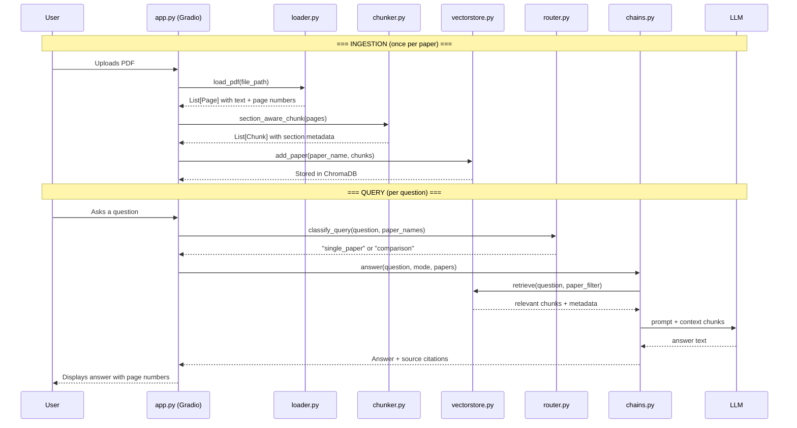
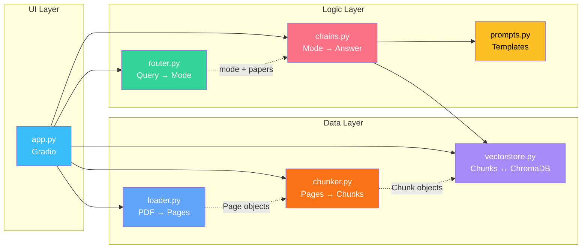

# Research Paper Q&A Agent 

A local-first **Retrieval-Augmented Generation (RAG)** system for asking questions
across academic PDFs and receiving answers with page citations.

Built as a portfolio project to demonstrate an end-to-end RAG pipeline: PDF
ingestion, two chunking strategies, local embeddings, vector retrieval,
single- and multi-paper QA, deterministic routing, cited answers, and a
reproducible retrieval benchmark.

### Engineering highlights

- End-to-end local pipeline using PyMuPDF, ChromaDB, LangChain, and Gradio
- Single-paper QA and two-paper comparison with source-page metadata
- Controlled comparison of naive and section-aware chunking over 30 questions
- Deterministic evaluation requiring no API keys or LLM grading
- 49 automated tests across loading, chunking, routing, retrieval, and chains

> **Benchmark finding:** the naive baseline achieved 0.298 source-page F1,
> compared with 0.260 for the first section-aware implementation. The analysis
> below treats this counterintuitive result as an engineering finding and
> identifies concrete improvements.

## Table of Contents

- [What It Does](#what-it-does)
- [Architecture](#architecture)
  - [Data Flow](#data-flow)
  - [Module Architecture](#module-architecture)
- [Controlled Chunking Experiment](#controlled-chunking-experiment)
  - [The Problem](#the-problem)
  - [The Solution](#the-solution)
  - [Measurable Impact](#measurable-impact)
  - [What likely affected the result](#what-likely-affected-the-result)
- [Tech Stack](#tech-stack)
- [Setup](#setup)
  - [Prerequisites](#prerequisites)
  - [Installation](#installation)
  - [Local model with Ollama](#local-model-with-ollama)
  - [Hosted model](#hosted-model)
- [Evaluation](#evaluation)
  - [Run the evaluation](#run-the-evaluation)
  - [Evaluation Metrics](#evaluation-metrics)
- [Running Tests](#running-tests)
- [Project Structure](#project-structure)
- [Design Decisions & Trade-offs](#design-decisions--trade-offs)
  - [Why keyword routing instead of LLM routing?](#why-keyword-routing-instead-of-llm-routing)
  - [Why local-first (Ollama + ChromaDB)?](#why-local-first-ollama--chromadb)
  - [Why both chunking strategies?](#why-both-chunking-strategies)
- [Future Work](#future-work)
- [License](#license)

## What It Does

1. **Upload** any academic PDF (lecture notes, papers, reports)
2. **Ask questions** in natural language — single-paper or cross-paper comparisons
3. **Get cited answers** with `[p. X]` references to the exact source pages
4. **Compare papers** side-by-side with auto-generated markdown tables

> _"Why are in-batch negatives efficient for training DPR?"_ → Answer with
> supporting page citations
>
> _"Compare the passage collections used by DPR and RAG."_ → Structured
> comparison table with citations from both papers

---

## Architecture

### Data Flow



### Module Architecture



Dependencies flow **downward** (UI → Logic → Data) or **sideways** (chains → prompts). No circular imports. Each module is independently testable.

---

## Controlled Chunking Experiment

The project tests a concrete hypothesis: **does respecting academic section
boundaries improve retrieval over a standard recursive character splitter?**
Both strategies are implemented and evaluated under the same retrieval pipeline.

### The Problem

A size-based splitter can combine text from adjacent sections and discard useful
document structure. Academic headings therefore appear to offer a natural signal
for creating more coherent chunks.

### The Solution

`section_aware_chunk()` in [`chunker.py`](src/chunker.py) detects section boundaries using regex patterns for:
- Numbered headings (`3.2 Multi-Head Attention`)
- Markdown headings (`## Abstract`)
- LaTeX sections (`\section{Introduction}`)
- Named sections (`Abstract`, `Conclusion`, `References`)

It splits at detected section boundaries first, then applies recursive
size-based splitting inside long sections. Every chunk carries `paper_title`,
`section`, `page_number`, and `chunk_index` metadata.

### Measurable Impact

Both chunking strategies are evaluated against the same 30-question annotated
paper/page benchmark:

| Metric | Naive Chunker | Section-Aware | Δ |
|---|---:|---:|---:|
| Source Page Recall@K | 0.517 | 0.456 | -0.061 |
| Source Page Precision@K | 0.219 | 0.193 | -0.026 |
| Source Page F1@K | 0.298 | 0.260 | -0.038 |

> In this benchmark run, naive chunking retrieved the annotated pages more
> effectively. Reproduce it with
> `uv run python eval/evaluate.py --ingest --chunker both`.

This result does **not** show that section-aware chunking is generally worse.
It shows that this regex-based implementation did not beat the baseline on the
current three-paper benchmark.

### What likely affected the result

The current evidence suggests several contributing factors rather than one
proven cause:

- The heading regex produces false positives on reference entries and table-like
  lines, including year-prefixed citations and training-set labels.
- Section-aware splitting produced 245 chunks versus 231 for the baseline, and
  35 chunks under 500 characters versus 14. Short fragments carry less context
  and compete for the same fixed top-K retrieval slots.
- Page-level scoring assigns each chunk one starting page. Relevant neighboring
  or cross-page evidence can therefore be missed by the metric.
- The benchmark contains only three papers and 30 questions, so the result should
  not be generalized to all academic documents.

Treating an unsuccessful hypothesis as an engineering result is intentional:
the benchmark exposed weaknesses in the first implementation and provides a
clear basis for the next iteration.

---

## Tech Stack

| Layer | Technology | Why |
|-------|-----------|-----|
| **PDF Extraction** | PyMuPDF (`fitz`) | Fast, handles complex layouts, no external dependencies |
| **Text Splitting** | Custom regex + LangChain `RecursiveCharacterTextSplitter` | Experimental section-aware strategy plus a measured baseline |
| **Embeddings** | `sentence-transformers/all-MiniLM-L6-v2` | Runs on CPU, no API key, 384-dimensional — good trade-off between quality and speed |
| **Vector Store** | ChromaDB (persistent, local) | Zero-config, embedded database with metadata filtering |
| **LLM** | LangChain chat models (Ollama by default) | One `provider:model` setting supports local or hosted inference |
| **Orchestration** | LangChain (LCEL) | Composable chains for QA and comparison prompts |
| **Query Routing** | Keyword matching | Deterministic, fast, free — saves LLM tokens for actual answers |
| **UI** | Gradio Blocks | Simple Python demo with uploads, chat, sources, and temporary share links |
| **Evaluation** | Local deterministic benchmark | Reproducible retrieval and citation metrics without API keys or LLM grading |
| **Testing** | pytest + pytest-mock | 49 tests covering loading, chunking, routing, retrieval, and chains |

---

## Setup

### Prerequisites
- Python 3.13+
- [uv](https://docs.astral.sh/uv/) (package manager)
- [Ollama](https://ollama.ai/) only when using a local model

### Installation

```bash
# 1. Clone the repo
git clone https://github.com/ronketer/paper-qa-agent.git
cd paper-qa-agent

# 2. Install dependencies
uv sync

# 3. Create local configuration
cp .env.example .env
```

### Local model with Ollama

Keep the default value in `.env`:

```dotenv
PAPER_QA_MODEL=ollama:qwen3:4b
```

Then download the model and ensure Ollama is running:

```bash
ollama pull qwen3:4b

# Run the app
uv run python app.py
```

Open http://localhost:7860 in a browser.

To create a temporary public Gradio link while the app continues running locally:

```bash
uv run python app.py --share
```

### Hosted model

Set `PAPER_QA_MODEL` using LangChain's `provider:model` format and install that provider's integration. For example:

```bash
uv add langchain-openai
```

```dotenv
PAPER_QA_MODEL=openai:gpt-4.1-mini
OPENAI_API_KEY=your-key
```

The same application code also works with prefixes such as `anthropic:`, `google-genai:`, and `openrouter:` once the matching LangChain integration is installed. Provider credentials remain in `.env` using the provider's standard variable.

Optional model settings:

| Variable | Purpose |
|---|---|
| `PAPER_QA_MODEL` | Application model in `provider:model` format |
| `PAPER_QA_MODEL_BASE_URL` | Custom Ollama or OpenAI-compatible endpoint |

Upload a PDF, click **Process and ingest**, then ask a question. Select one paper for Q&A, two for comparison, or no papers for automatic routing.

---

## Evaluation

The project includes a **30-question benchmark** covering three question types.
The runner executes locally using the embedding retriever; it requires no
Langfuse credentials, answer-generation model, or LLM judge.

| Type | Count | Example |
|------|-------|---------|
| **Factual** | 10 | _"Which generator model does the RAG paper use?"_ |
| **Reasoning** | 10 | _"Why are in-batch negatives efficient for training DPR?"_ |
| **Comparison** | 10 | _"Compare the passage collections used by DPR and RAG."_ |

### Run the evaluation

```bash
# Optional metric-arithmetic smoke test (does not load papers or embeddings):
uv run python eval/evaluate.py --smoke-test

# Complete benchmark comparison:
uv run python eval/evaluate.py --ingest --chunker both
```

With `--ingest --chunker both`, the runner clears and rebuilds the local Chroma
index for each strategy, evaluates all 30 questions, computes macro averages, and
prints a Markdown comparison table. Gold source-page annotations are used only
for scoring, not as retrieval input.

The latest committed run produced:

| Metric | Naive | Section-aware | Δ |
|---|---:|---:|---:|
| Source-page Hit@K | 0.700 | 0.633 | -0.067 |
| Source-page Recall@K | 0.517 | 0.456 | -0.061 |
| Source-page Precision@K | 0.219 | 0.193 | -0.026 |
| Source-page F1@K | 0.298 | 0.260 | -0.038 |
| Source-paper Recall | 1.000 | 1.000 | +0.000 |
| Citation Presence | 1.000 | 1.000 | +0.000 |
| Citation Validity | 1.000 | 1.000 | +0.000 |

See [`eval/results.md`](eval/results.md) for reproduction details and interpretation.

### Evaluation Metrics

| Metric | What It Measures |
|--------|-----------------|
| **Source Page Hit@K** | Did retrieval find at least one annotated paper/page pair? |
| **Source Page Precision/Recall/F1@K** | How much retrieved evidence is annotated and how much annotated evidence was found? |
| **Source Paper Recall** | Whether all required papers were represented in retrieved evidence, especially for comparisons |
| **Citation Presence/Validity** | Can retrieved page metadata be emitted as citations backed by retrieved pages? |

Deterministic metrics use a 0–1 scale per item. Use source-page recall as the
primary retrieval metric, precision/F1 to detect noisy retrieval, and source-paper
recall to catch incomplete comparisons. Boolean metrics are also averaged as 0/1
run-level scores. These metrics isolate the chunking/retrieval experiment: recall
rewards coverage of annotated evidence, precision penalizes extra unannotated
paper/page pairs, and F1 balances both. Citation validity is a provenance pipeline
check, not a measure of answer correctness or chunk relevance. Semantic answer
grading is intentionally out of scope because LLM-as-a-judge is disabled.

The benchmark measures retrieval and citation provenance, not generated-answer
correctness. Source-page annotations may also be incomplete: a useful neighboring
page is counted as irrelevant when it is not part of the gold annotation.

---

## Running Tests

```bash
uv run pytest tests/ -v
```

**49 tests** across 5 modules:

| Module | Tests | Approach |
|--------|-------|----------|
| `test_loader.py` | 9 | Integration tests against real PDFs from `papers/` |
| `test_chunker.py` | 18 | Unit tests with synthetic text — section detection, boundary respect, metadata |
| `test_chains.py` | 4 | Mocked LLM + retriever — verifies output structure and citation format |
| `test_router.py` | 12 | Unit tests for paper-name extraction and single-paper/comparison routing |
| `test_vectorstore.py` | 6 | Mocked ChromaDB — verifies metadata, filtering, multi-paper k-distribution |

---

## Project Structure

```
paper-qa-agent/
│
├── src/                        # Core pipeline logic
│   ├── loader.py               # PDF → structured pages (PyMuPDF)
│   ├── chunker.py              # Naive and section-aware chunking strategies
│   ├── vectorstore.py          # Chunks ↔ ChromaDB (store, retrieve, filter, delete)
│   ├── chains.py               # LangChain LCEL chains for QA + comparison
│   ├── prompts.py              # All prompt templates (QA + comparison)
│   └── router.py               # Query classification (single-paper vs comparison)
│
├── app.py                      # Gradio demo (upload, chat, source viewer)
├── main.py                     # Compatibility entrypoint for app.py
│
├── papers/                     # Sample PDFs for demo and evaluation
│   ├── dpr_karpukhin_2020.pdf
│   ├── rag_lewis_2020.pdf
│   └── realm_guu_2020.pdf
│
├── eval/                       # Evaluation framework
│   ├── benchmark.json          # 30 curated Q&A pairs (factual/reasoning/comparison)
│   ├── evaluate.py             # Local deterministic benchmark runner
│   └── results.md              # Latest measured chunker comparison
│
├── tests/                      # Test suite (49 tests)
│   ├── conftest.py             # Shared fixtures (papers_dir, sample_pdf)
│   ├── test_loader.py          # PDF loading tests
│   ├── test_chunker.py         # Chunking logic + section detection tests
│   ├── test_chains.py          # Chain output structure tests (mocked)
│   ├── test_router.py          # Query classification tests
│   └── test_vectorstore.py     # Vector store operation tests (mocked)
│
├── pyproject.toml              # Dependencies and project config
└── README.md
```

---

## Design Decisions & Trade-offs

### Why keyword routing instead of LLM routing?

The router uses keyword matching (`"compare"`, `"vs"`, `"differ"`, etc.) to classify queries as single-paper or comparison. An LLM could do this, but:
- Keywords are **deterministic** — same input always gives same routing
- Keywords are **free** — no LLM tokens consumed on routing
- Keywords are **fast** — microseconds vs seconds
- Keywords are **testable** — easy to write unit tests with predictable outcomes

The LLM tokens are reserved for where they add the most value: generating the actual answer.

### Why local-first (Ollama + ChromaDB)?

- **Zero API costs** — runs entirely on a consumer laptop
- **No provider account required** — the default Ollama path needs no model API key
- **Swappable** — change `PAPER_QA_MODEL` without changing application code
- **Privacy** — paper content never leaves the machine

### Why both chunking strategies?

Building both `naive_chunk()` and `section_aware_chunk()` enables a controlled
experiment: same PDFs, questions, embedding model, router, retrieval limits, and
metrics—only the chunker changes. The baseline winning is itself useful: it
demonstrates why retrieval changes should be measured instead of assumed to help.

---

## Future Work

- [x] Run the benchmark and commit deterministic retrieval/citation results comparing both chunkers.
- [ ] Tighten heading detection to reject references, table rows, and other false positives.
- [ ] Add a minimum chunk length and merge undersized adjacent section fragments.
- [ ] Compare strategies at a fixed retrieved-token budget in addition to fixed top-K.
- [ ] Store page spans rather than only each chunk's starting page.
- [ ] Expand the benchmark beyond three papers and report per-question error analysis.
- [ ] Add a short demo video or deploy a public demo.
- [ ] **Agentic RAG** — wrap the retriever as a tool the LLM chooses to call (inspired by [HuggingFace Agents Course](https://huggingface.co/learn/agents-course/unit3/agentic-rag/introduction))
- [ ] **Conversation memory** — allow follow-up questions across turns
- [ ] **Hybrid search** — combine BM25 (keyword) with embedding-based retrieval
- [ ] **Multi-paper comparison (3+)** — extend beyond two-paper comparisons

---

## License

MIT
